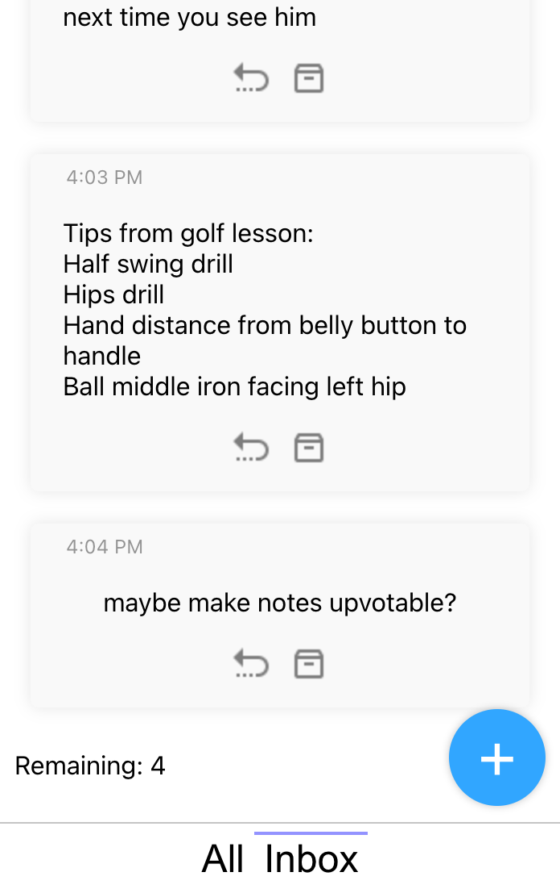

# Quick Capture

This is an experimental quick capture tool for mobile. You can try out a demo of it [here](https://taylormitchell.github.io/quick-capture/). 

<div style="display: flex; justify-content: center">
    
</div>

Quick Capture attempts to solve a problem which many note-taking apps have: once you put a note in, you never see it again. 

The proposed solution is to repeatedly schedule every single note for review. That may sound like an absurd amount of work for the user, but if you use an expanding schedule (common in flashcard apps like [Anki](https://apps.ankiweb.net/)), you can ensure that even as your collection of notes grows indefinitely, the time spent reviewing old notes stays approximately constant. 

**How it works**: Whenever a note is added, it becomes due for review. Whenever a note is due, it'll appear in your inbox. To process your inbox, you go through each note and decide if you want to keep it or archive it. If you archive it, you'll never see the note again. If you keep it, the app will schedule it again for a later date. Every time you review and decide to keep a note, it's scheduled twice as far into the future as it was last time. So initially you'll see a note every few days, then every few weeks, then eventually months and years apart. 

## Setup

This app isn't really meant for anyone else to use, but if you'd like to try spinning it up your yourself, here's how to do it:

Install
```
git clone https://github.com/taylormitchell/quick-capture
cd quick-capture/src
npm run install-full
```

Run in dev
```
npm run start
```

Run in prod
```
npm run build
npm run prod
```